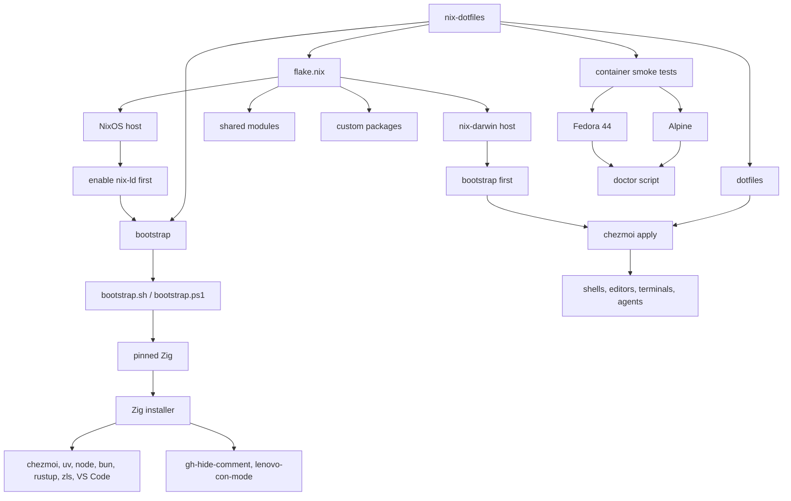

<h1 align="center">nix-dotfiles</h1>

<p align="center">
  <b>
    My Nix and chezmoi setup for getting a machine back to feeling like mine
    without spending a whole weekend on it
  </b>
</p>

<p align="center">
  <a href="#repo-map">Repo map</a>
  ·
  <a href="#system-flow">System flow</a>
  ·
  <a href="#bootstrap">Bootstrap</a>
  ·
  <a href="#system-builds">System builds</a>
  ·
  <a href="#smoke-tests">Smoke tests</a>
</p>

<p align="center">
  <a href="https://nixos.org">
    
  </a>
  <a href="https://github.com/nix-darwin/nix-darwin">
    
  </a>
  <a href="https://www.chezmoi.io/">
    
  </a>
  <a href="https://ziglang.org/">
    
  </a>
  <a href="https://catppuccin.com/">
    
  </a>
</p>

<p align="center">
  <a href="https://getfedora.org/">
    
  </a>
  <a href="https://fedoraproject.org/atomic-desktops/kinoite/">
    
  </a>
  <a href="https://www.alpinelinux.org/">
    
  </a>
  <a href="https://www.apple.com/os/macos/">
    
  </a>
  <a href="https://www.microsoft.com/windows/">
    
  </a>
</p>

> [!IMPORTANT]
> These are personal dotfiles, not a generic installer. Borrow freely, but
> expect to replace hostnames, users, secrets, hardware config, paid font
> settings, and anything that smells like my machine.

## Repo Map

| Path                            | What lives there                                                                                                    |
| ------------------------------- | ------------------------------------------------------------------------------------------------------------------- |
| [`flake.nix`](flake.nix)        | Nix flake inputs, supported systems, NixOS/nix-darwin exports, and package wiring.                                  |
| [`hosts/linux`](hosts/linux)    | NixOS host configuration, hardware, networking, users, services, sound, and programs.                               |
| [`hosts/darwin`](hosts/darwin)  | nix-darwin host configuration, Tailscale, SOPS, Ghidra MCP, and macOS user setup.                                   |
| [`modules`](modules)            | Shared, Linux, and Darwin modules for packages, fonts, Nix settings, Nixcord, Kanata, launchd, and services.        |
| [`dotfiles`](dotfiles)          | chezmoi templates for shells, editors, terminals, agents, Git, SSH, Yazi, Zellij, Codex, and app configs.           |
| [`bootstrap`](bootstrap)        | POSIX and PowerShell bootstrap scripts, the tool manifest, and the doctor/update helpers.                           |
| [`lib/zig`](lib/zig)            | Reusable Zig code for bootstrap and chezmoi helper scripts.                                                         |
| [`pkgs`](pkgs)                  | Custom Nix packages, local Zig tools, patched packages, and private font builder glue.                              |
| [`compose.yaml`](compose.yaml)  | Alpine and Fedora smoke tests for making sure bootstrap still works.                                                |

## System Flow

The basic rule is: Nix owns the machine, bootstrap owns the tools I do not want
to wait on nixpkgs for

Nix is still where the host shape lives: services, patched packages, system
settings, and all the parts that are nicer when they are declarative. Bootstrap
handles the fast-moving userland stuff like Node, bun, uv, Zig, ZLS, ruff, ty,
and yt-dlp. Those tools usually have good upstream binaries, and I would rather
use those than kick off a rebuild because I wanted a newer CLI



## Bootstrap

Run this when the machine needs the fast-moving tools:

```bash
./bootstrap/bootstrap.sh
```

On Windows, start from the built-in Windows PowerShell 5.1. The wrapper gets you
to PowerShell 7, installs the pinned x86_64 Zig, and then runs the same Zig
installer as the Unix path

```powershell
.\bootstrap\bootstrap.ps1
```

<details>
<summary>How the bootstrap is staged</summary>

The Unix path is staged like this:

1. `bootstrap.sh` checks the bare minimum, creates `~/.local/bin` and
   `~/.local/opt`, installs the pinned Zig from
   [`bootstrap/zig-artifacts.tsv`](bootstrap/zig-artifacts.tsv), links it as
   `~/.local/bin/zig`, and gets out of the way
2. the Zig installer reads the manifest and installs `chezmoi`, `uv`, Rust via
   `rustup`, archive tools like `node`, `bun`, `zls`, `ziglint`, and VS Code,
   `uv tool` packages like `ruff`, `ty`, and `yt-dlp`, plus the repo-local Zig
   tools
3. after that, the machine gets the boring-but-important bits: `chezmoi apply`
   and, where needed, a NixOS or nix-darwin rebuild

NixOS is the one platform where the order flips on first setup. Rebuild NixOS
first so this config can enable `nix-ld` and add the musl loader links. Then
bootstrap can run upstream Linux binaries without every tool becoming a Nix
packaging side quest. On macOS and normal FHS Linux distros, bootstrap can go
first

`chezmoi` comes from the official `get.chezmoi.io` installer. The Zig scripts
are built with the bootstrap-managed Zig. That is intentional: Nix does not need
to babysit these binaries

The Windows path is a little more fussy because Windows is Windows. The 5.1
wrapper installs or updates PowerShell 7, then `bootstrap-pwsh.ps1` installs the
pinned Windows Zig, checks that the MSVC C++ build tools and Windows SDK exist,
runs the same manifest installer, points Windows Terminal at PowerShell 7, and
runs `zig build check` unless you pass `-SkipZigCheck`. `-SkipMsvcBuildTools`
only makes sense if you already installed the MSVC bits yourself; the bootstrap
still stops if they are missing

After bootstrap, `./bootstrap/update.sh` runs the installer in update mode.
`./bootstrap/doctor.sh` tells you what it can see and where the tools are coming
from

On Linux, Node comes from the unofficial musl builds. That means non-musl
distros need `/lib/ld-musl-*.so.1`; the NixOS config and Fedora smoke test both
set that up

</details>

## System Builds

The first-run order matters:

- **NixOS:** rebuild first, then bootstrap, then `chezmoi`
- **macOS and normal FHS Linux:** bootstrap first, then `chezmoi`, then the Nix
  system if you are using one

### NixOS

```bash
# Replace my secrets or change hosts/linux/users.nix so it does not need them.

# Delete my hardware-configuration.nix and generate one for your machine.
if [ ! -f "hosts/linux/hardware-configuration.nix" ]; then
  nixos-generate-config
  mv "hardware-configuration.nix" "hosts/linux/hardware-configuration.nix"
  rm "configuration.nix"
fi

# Optional: disable private paid fonts if you do not have access to the font repo
# by setting `flame.fonts.paid.enable = false;` in your host config.

nixos-rebuild switch --use-remote-sudo --flake $(readlink -f "/etc/nixos")

# Now nix-ld and the musl loader links exist, so upstream binaries can run.
./bootstrap/bootstrap.sh

# Apply the dotfiles.
chezmoi apply --refresh-externals=always --force

# After initial build, you can use the `rebuild` and `cza` aliases.
```

### macOS

```bash
./bootstrap/bootstrap.sh
chezmoi apply --refresh-externals=always --force

# I use /etc/nixos as the shared flake path on both NixOS and Darwin.
sudo ln -s ~/Developer/nix-dotfiles/ "/etc/nixos"

nix run nix-darwin -- switch --flake $(readlink -f "/etc/nixos/")

sudo darwin-rebuild switch --flake $(readlink -f "/etc/nixos/")

# After initial build, you can use the `rebuild` alias.
```

## Smoke Tests

The Dockerfile is here to keep me honest. It boots an Alpine or Fedora base,
runs bootstrap, checks that `node`, `npm`, and `npx` came from bootstrap instead
of the distro package manager, applies a focused slice of the dotfiles, and runs
the doctor script

```bash
# Build and test Alpine.
docker compose build alpine

# Build and test Fedora 44.
docker compose build fedora-44

# Build and test both services.
docker compose build

# Rebuild from scratch when cache is hiding something.
docker compose build --no-cache alpine
docker compose build --no-cache fedora-44
```

After a build, poke at either image:

```bash
docker compose run --rm alpine sh -c './bootstrap/doctor.sh doctor'
docker compose run --rm fedora-44 bash -c './bootstrap/doctor.sh doctor'

docker compose run --rm alpine sh -c 'node --version && npm --version && npx --version'
docker compose run --rm fedora-44 bash -c 'node --version && npm --version && npx --version'
```

`compose.yaml` uses `fedora:44`. That is just the Fedora container base, not the
whole graphical Workstation thing. Compose only picks the base image; the
Dockerfile still does the actual test setup

## Catppuccin Bits

The README uses Catppuccin colors because the rest of the repo already does

| Area               | Config                                                                                                                                                                           |
| ------------------ | -------------------------------------------------------------------------------------------------------------------------------------------------------------------------------- |
| Shell prompt       | [`dotfiles/dot_config/starship.toml`](dotfiles/dot_config/starship.toml)                                                                                                         |
| Editor             | [`dotfiles/dot_config/helix/config.toml`](dotfiles/dot_config/helix/config.toml), [`dotfiles/dot_config/zed/settings.json`](dotfiles/dot_config/zed/settings.json)               |
| Terminal and panes | [`dotfiles/dot_config/ghostty/config.tmpl`](dotfiles/dot_config/ghostty/config.tmpl), [`dotfiles/dot_config/zellij/config.kdl.tmpl`](dotfiles/dot_config/zellij/config.kdl.tmpl) |
| File manager       | [`dotfiles/dot_config/yazi/theme.toml`](dotfiles/dot_config/yazi/theme.toml)                                                                                                     |
| Agent themes       | [`dotfiles/dot_pi/agent/themes`](dotfiles/dot_pi/agent/themes)                                                                                                                   |
| Discord            | [`modules/common/nixcord`](modules/common/nixcord)                                                                                                                               |

## License

This repository is licensed under the terms in [`LICENSE.txt`](LICENSE.txt)
